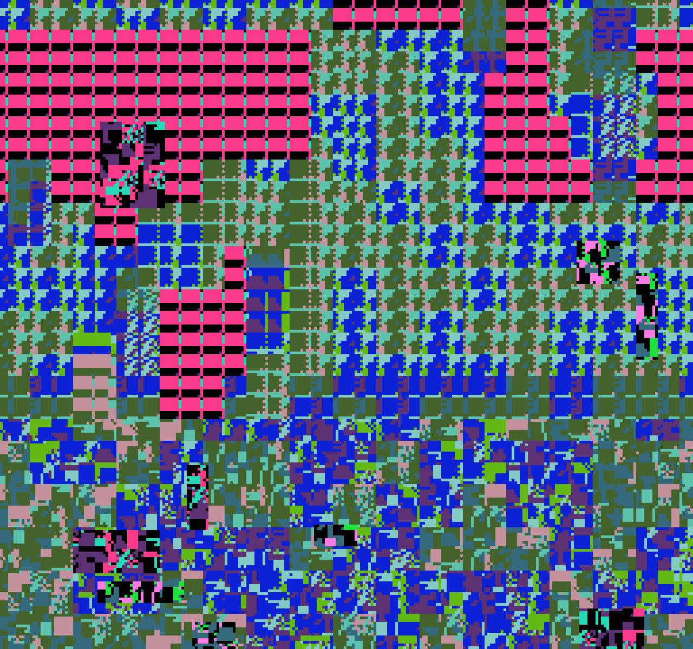
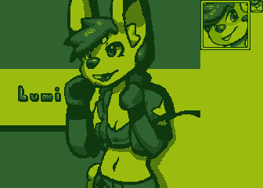
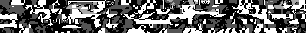

# Game-Glitch-Generator
Create a glitched image from a sprite table in the style of NES, SNES, or Gameboy

# What it is
There are two functions written in PHP. One allows you to optimize a sprite table, and the other allows you to create a glitched image based on this sprite table. The resulting image looks like a glitched image from the NES, SNES, or Gameboy, generated with the limitations of each in mind.

Here is an example of what the code does:

You can also view [@ErrGraphic](https://twitter.com/errgraphic) on Twitter to see my bot which uses this code.

# What's contained?

## <code>glitchedimggen.php</code>

Inside <code>glitchedimggen.php</code> there are two functions

### <code>spriteTableOpt()</code>
This generates an optimizes sprite table and removes duplicate tiles from the table, to give a better overall result. It takes the following arguments:

><b><code>$sourcetable</code></b> - Path to source sprite table
>
> This is the path to the sprite table we'll be optimizing. It MUST be an 8x8 4 color image. If you open this in GIMP or Aseprite, you can easily add graphics to it. Here is an example:
>
> 
>
> Notice all the blank spaces. That's what this function will remove.

><b><code>$desttable</code></b> - Path to save optimized sprite table to
>
> This is where we will save the optmized sprite table to. Here is an example:
>
> 
>
> You can see all blank spaces and duplicate entries have been removed entirely.

> <b><code>$trimbott</code> (OPTIONAL)</b> [Default <code>true</code>] - Trims the last row off
>
> This trims the last row off of the image. This can be useful because the last row will more than likely have excess blank tiles on it. In the example above, the last row has been trimmed off.

> <b><code>$tablecols</code> (OPTIONAL)</b> [Default <code>32</code>] - Width of the optimized sprite table, in columns
>
> This specifies the width of the resulting optimized sprite table. 

> <b><code>Returns:</code> Nothing</b>

### <code>glitchedImgGen()</code>
This function creates a glitched image based on the sprite table that we made with <code>spriteTableOpt()</code>. It takes the following arguments:

> <b><code>$spritetablepath</code></b> - Path to source sprite table
>
> This is where we'll find the optimized sprite table. It should be composed of 8x8 tiles. This allows you to use this function multiple times with multiple sprite tables, if you so choose.

><b><code>$outputpath</code></b> - Path where we'll save the image.
>
> This is where we'll save the output glitched image. At the top of this README is an example of what this code outputs.

> <b><code>$upscalemult</code> (OPTIONAL)</b> [Default <code>3</code>] - How much we'll upscale the image
>
> This specifies how much we'll upscale the image. Set to 1 to have a 1:1 output ratio.

> <b><code>$gphxmode</code> (OPTIONAL)</b> [Default <code>'DEFAULT'</code>] - Output mode of the glitched graphics
>
> This mode forces a specific output mode to be chosen. Valid arguments are <code>NES</code>, <code>SNES</code>, and <code>GB</code>. If you don't specify this, or put <code>null</code> or some other argument that isn't valid, the script will simply choose it's own randomly (the default behavior)

> <b><code>$alphaborder</code> (OPTIONAL)</b> [Default <code>true</code>] - Adds a transparent border around the image
>
> This adds a transparent border around the image. This is useful because Twitter automatically converts all PNGs to JPG if there is no transparency in the image. With a transparent border, it forces Twitter to keep it as a PNG. This allows people to download the image and the palette information will be retained.

> <b><code>Returns:</code> Nothing</b>

## <code>example.php</code>

This file contains an example usage with the provided images. You can run this from the shell, or through a web browser.

## <code>example.png</code>

Example file containing some sprites that I have made. You can modify it to contain your own sprites. Be sure to keep the size a multiple of 8, to avoid errors.

## <code>exampleopt.png</code>

Example image of what you can expect to see by using <code>spriteTableOpt()</code>. You should definitely optimize your sprite table before creating an image with it, to avoid duplicate tiles and blanks.

## <code>exampleoutput.png</code>

This is an example of what this code does. You can also visit my bot @ErrGraphic on Twitter to see what it does.

# About the output

This outputs glitched images in NES, SNES, or Gameboy style, with the limitations of each in mind. Each tile is sourced from an 8x8 part of the tileset produced by <code>spriteTableOpt()</code>. It has a chance of producing randomized pixels, to emulate the game reading from program ROM instead of graphics ROM. It also flips and rotates tiles, to add to the corruption. It also has a chance of offsetting the sourced tile, so that it will read part of 4 tiles instead of just one from the tileset.

Here is a description of the modes and their differences in output:

## NES Mode

In NES mode, a background color is picked, followed by 4 palette tables from the NES palette. This script uses the NES palette specified from the Nestopia emulator. It outputs an image in <code>256 x 240</code> resolution. It also scrolls vertically OR horizontally randomly. It only scrolls in one direction, as the NES also can only scroll in one direction. The output is done in chunks of 4 tiles, with one palette assigned to each chunk of 4 tiles, to match how the NES assigns palettes to the background layer.

## SNES Mode

In SNES mode, it emulates MODE 1 of the SNES. This mode has two background layers with 16 colors, and 1 background layer of 4 colors. For simplicity, this script only generates the two background layers with 16 colors. Two palettes with 16 colors are picked, with a result of 32 colors. The colors are picked to match the 15bit color specification of the SNES (see the comments in <code>glitchedimggen.php</code> for details.) It also outputs an image in <code>256 x 240</code>, to match the SNES. It adds a scroll offset in both horizontal and vertical.

## Gameboy Mode

In Gameboy mode, it picks 4 colors from a prespecified table (please see <code>glitchedimggen.php</code> for the table.) The colors are stored in RRGGBBRRGGBBRRGGBBRRGGBB, or four RRGGBB hex values, starting with the brightest color. In this way, it is possible to add your own colors. I have included palettes from the Super Gameboy, the Gameboy Color, and some of my own palettes as well. It produces an image that is <code>160 x 144</code>, to match the original Gameboy, and also scrolls horizontally OR vertically.

# Questions?

If you have any questions about this script, you can reach out to me either here or on Twitter at [@FxSql](https://twitter.com/fxsql). I hope that you enjoy this script!

# Requirements
It requires PHP 5.5 or PHP 7 with GD installed.
